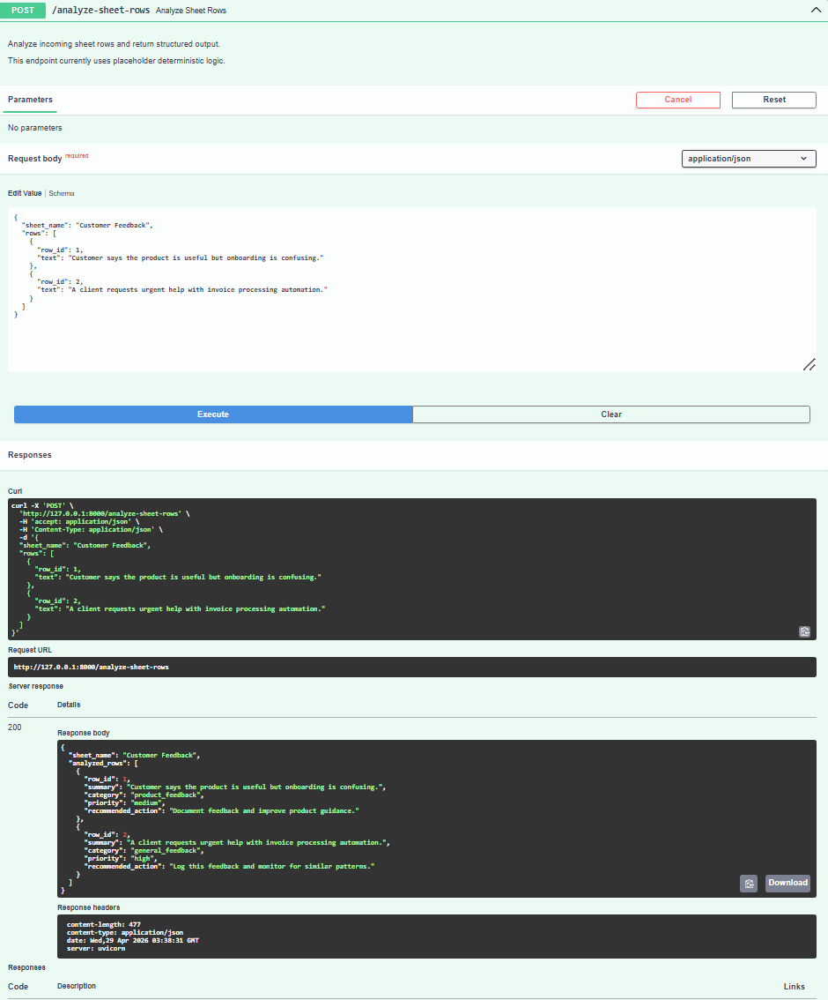

# AI Google Sheets Automation - FastAPI Backend

Structured FastAPI service that turns Google Sheets-style business rows into AI-generated summaries, categories, priorities, and recommended actions.

[](https://github.com/vodolij888Igor/ai-google-sheets-automation/actions/workflows/tests.yml)

## Project Overview
This project is a portfolio-ready backend API that simulates Google Sheets automation with real OpenAI-powered analysis.
It accepts rows from a sheet-like JSON payload and returns structured insights for each row.

The purpose is to demonstrate practical backend API development for an **AI Automation & Integration Developer** profile, with clear pathways to evolve into a full-stack AI product.

## Business Use Case
Teams often collect customer feedback in Google Sheets, but manually reviewing rows is slow and inconsistent.
This API shows how sheet rows can be processed automatically into:
- concise summaries
- categories
- priority levels
- recommended actions

This improves operational visibility and helps teams prioritize what to fix first.

## Tech Stack
- **Python**
- **FastAPI**
- **Pydantic**
- **Uvicorn**
- **OpenAI API**

## Project Structure
```text
.
|-- app/
|   |-- main.py
|   |-- schemas/
|   |   `-- sheet_schema.py
|   `-- services/
|       `-- sheet_service.py
|-- .env.example
|-- .gitignore
|-- pytest.ini
|-- requirements.txt
|-- tests/
`-- README.md
```

## Running Tests

Tests mock the OpenAI client so they do not call the real API and do not require a valid `OPENAI_API_KEY`.

```powershell
pip install -r requirements.txt
pytest
```

## Setup Instructions
1. Create and activate a virtual environment:
   - Windows (PowerShell):
     ```powershell
     python -m venv .venv
     .\.venv\Scripts\Activate.ps1
     ```
2. Install dependencies:
   ```powershell
   pip install -r requirements.txt
   ```
3. (Optional) Copy `.env.example` to `.env` and adjust values.
   - Add your key:
     ```env
     OPENAI_API_KEY=your_openai_api_key_here
     ```
4. Run the API server:
   ```powershell
   uvicorn app.main:app --reload --port 8000
   ```
5. Open API docs:
   - Swagger UI: [http://localhost:8000/docs](http://localhost:8000/docs)
   - ReDoc: [http://localhost:8000/redoc](http://localhost:8000/redoc)

## Required Endpoint
### `POST /analyze-sheet-rows`

### Sample Request
```json
{
  "sheet_name": "Customer Feedback",
  "rows": [
    {
      "row_id": 1,
      "text": "Customer says the product is useful but onboarding is confusing."
    }
  ]
}
```

### Sample Response
```json
{
  "sheet_name": "Customer Feedback",
  "analyzed_rows": [
    {
      "row_id": 1,
      "summary": "Customer finds the product useful but has onboarding confusion.",
      "category": "customer_feedback",
      "priority": "medium",
      "recommended_action": "Improve onboarding instructions and update help content."
    }
  ]
}
```

### Supported AI Labels
- `category`: `customer_feedback`, `sales_lead`, `invoice_processing`, `support_request`, `operations`, `other`
- `priority`: `low`, `medium`, `high`

## Screenshot

The screenshot below shows a successful POST /analyze-sheet-rows request in FastAPI Swagger UI with a 200 response.



## API Usage Examples

The examples below assume the API is running locally (for example after `uvicorn app.main:app --reload --port 8000`). They illustrate a realistic sheet where **customer feedback**, **support requests**, and **invoice automation** notes are collected in one tab before being sent to the API as JSON.

### cURL (`POST /analyze-sheet-rows`)

```bash
curl -X POST "http://127.0.0.1:8000/analyze-sheet-rows" \
  -H "Content-Type: application/json" \
  -d '{
    "sheet_name": "Customer Feedback",
    "rows": [
      {
        "row_id": 1,
        "text": "Customer says the product is useful but onboarding is confusing."
      },
      {
        "row_id": 2,
        "text": "Support ticket: user cannot reset password and needs access restored today."
      },
      {
        "row_id": 3,
        "text": "Invoice automation: please extract vendor name, invoice number, and due date from attached PDF text."
      }
    ]
  }'
```

On Windows PowerShell you can use the same URL and headers with `Invoke-RestMethod` or a single-line `curl.exe` if your shell quoting differs.

### Example successful JSON response

Shape matches the API contract. Field values are illustrative; with a live `OPENAI_API_KEY`, summaries and actions are generated by the model.

```json
{
  "sheet_name": "Customer Feedback",
  "analyzed_rows": [
    {
      "row_id": 1,
      "summary": "Customer values the product but finds onboarding unclear.",
      "category": "customer_feedback",
      "priority": "medium",
      "recommended_action": "Simplify onboarding steps and update in-app guidance."
    }
  ]
}
```

### Postman

1. Create a new request: method **POST**, URL `http://127.0.0.1:8000/analyze-sheet-rows`.
2. Under **Headers**, add `Content-Type` with value `application/json`.
3. Under **Body**, choose **raw** and **JSON**, then paste a payload with `sheet_name` and `rows` (each row needs `row_id` and `text`).
4. Send the request and confirm **200 OK**. In the response body, verify `sheet_name`, `analyzed_rows`, and for each item: `summary`, `category`, `priority`, and `recommended_action`.

## Current Limitations (Version 1)
- Requires a valid `OPENAI_API_KEY` in `.env`.
- No direct Google Sheets API integration yet.
- AI output quality depends on prompt/model behavior and input quality.
- No authentication, persistence, or background processing.

## Architecture

This repository follows a small, production-oriented layout suitable for a portfolio review: a thin HTTP layer, validated contracts, and a dedicated service for AI calls.

- The **FastAPI** application exposes **`POST /analyze-sheet-rows`**, the single analysis endpoint used by clients and docs.
- **Pydantic** schemas validate incoming JSON and the structured response, so invalid payloads fail fast with clear errors.
- The **service layer** (`app/services/sheet_service.py`) owns OpenAI interaction, error mapping, and normalization of model output into the API contract.
- **Environment variables** (including `OPENAI_API_KEY`) are loaded from a local **`.env`** file via `python-dotenv`, keeping secrets out of source control.
- **Swagger UI** (and ReDoc) ship with FastAPI for interactive exploration and manual testing without extra tooling.
- **Automated tests** mock the OpenAI client so the suite verifies HTTP behavior and response shape **without** calling the real API or requiring a key in CI.
- The **current version** simulates Google Sheets by accepting **JSON rows** in the request body rather than reading a live spreadsheet.

### Request flow (high level)

```text
Client / Swagger / Postman
        ↓
FastAPI route: POST /analyze-sheet-rows
        ↓
Pydantic validation
        ↓
Sheet analysis service layer
        ↓
OpenAI API
        ↓
JSON response: summary, category, priority, recommended_action
```

## Limitations

Scope is intentionally narrow: this is a **backend portfolio project**, not a shipped Google Sheets add-on or full product surface.

- It is **not** a full Google Sheets add-on or sidebar experience yet.
- It does **not** connect to the **live Google Sheets API**; rows are supplied as JSON to mirror sheet data.
- It does **not** persist analyzed rows in a **database**; each request is stateless from the API’s perspective.
- It does **not** implement **authentication** or multi-tenant access control.
- It does **not** include a **frontend dashboard** for triage or analytics.
- It is designed as a **clean local API demo** you can run, document, and extend without operational overhead.

**Future versions** could add real Google Sheets API integration, database storage for history and reporting, user authentication, production deployment patterns, scheduled automations (for example sync-on-a-timer or webhook-driven runs), and a frontend dashboard for reviewers and operators.

## Business Value

This project shows how **spreadsheet-based business data** can be analyzed automatically with AI so teams spend less time on **manual review**, can **prioritize** what matters, and move from **raw rows** to **structured, actionable fields** (summary, category, priority, next step).

The same pattern applies wherever work still lives in sheets: **customer feedback**, **support tickets**, **invoice or finance requests**, **sales leads**, **operations notes**, or **CRM exports**—any tabular intake that benefits from consistent classification before humans act on it.

## Example Use Cases

- Customer feedback categorization and prioritization
- Support request triage from spreadsheet rows
- Invoice or finance request routing
- Sales lead qualification from Google Sheets exports
- Operations task analysis and follow-up recommendations
- CRM or form submission cleanup before importing into another system

## Future Google Sheets Integration Plan

**Today:** the API **simulates** Google Sheets by accepting **JSON rows** in the request body. There is **no live Google Sheets API integration** in this repository yet.

**Next step (conceptual):** a future version could connect **directly** to the **Google Sheets API** using OAuth or a service account, read rows from a **selected sheet and range**, run the same OpenAI analysis used here, and **write results back** into **new columns** on the same sheet (or a dedicated output tab).

**Possible output columns:** `summary`, `category`, `priority`, `recommended_action`, `processed_at`.

That path keeps the current backend contract as the core and swaps “JSON in the body” for “read/write via Sheets API” when you are ready to operationalize it.

## Future Improvements
- Add retries/circuit breaking and stronger observability around AI calls.
- Connect directly to Google Sheets API for scheduled or event-driven ingestion.
- Add auth and role-based access for production deployment.
- Add database storage for analysis history and analytics dashboards.
- Add CI/CD pipeline (tests are included locally with pytest).

## Why This Project Matters for Portfolio
This project demonstrates:
- API design for automation workflows
- schema-first request/response validation
- service-layer architecture that is ready for AI provider integration
- practical business framing, not just technical implementation

## Quality Checklist

Delivery and documentation status for reviewers:

- [x] FastAPI backend implemented
- [x] `POST /analyze-sheet-rows` endpoint working
- [x] Real OpenAI API integration added
- [x] Simulated Google Sheets rows supported through JSON input
- [x] Swagger UI tested successfully
- [x] Screenshot added to README
- [x] API usage examples included
- [x] Automated tests added with pytest
- [x] OpenAI calls mocked in tests
- [x] GitHub Actions CI added
- [x] Environment variables handled with `.env`
- [x] `.env` excluded from GitHub
- [x] Architecture documented
- [x] Limitations documented
- [x] Project pushed to GitHub
